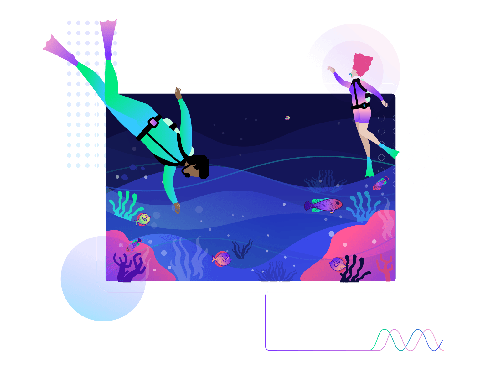
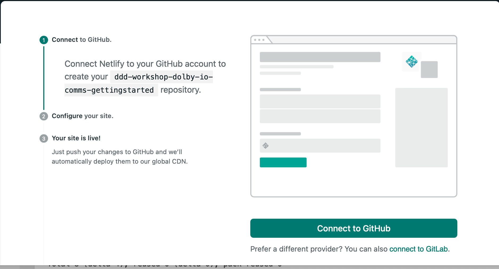
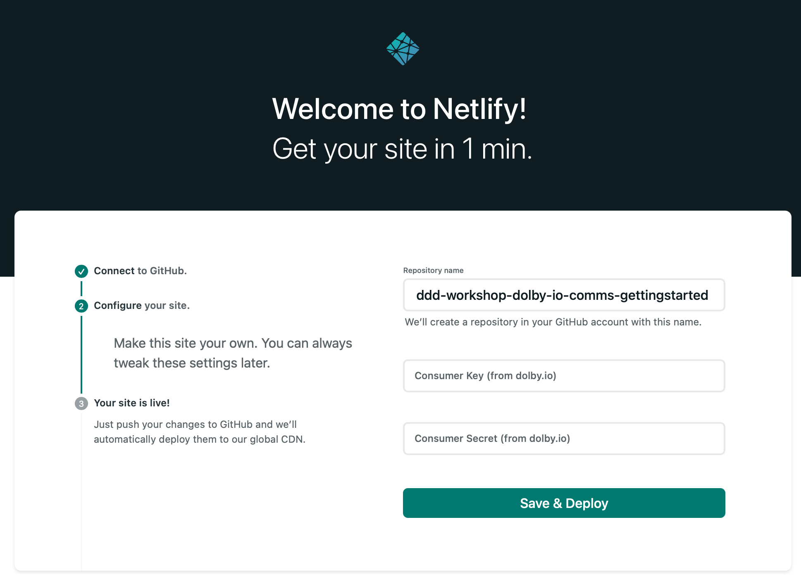
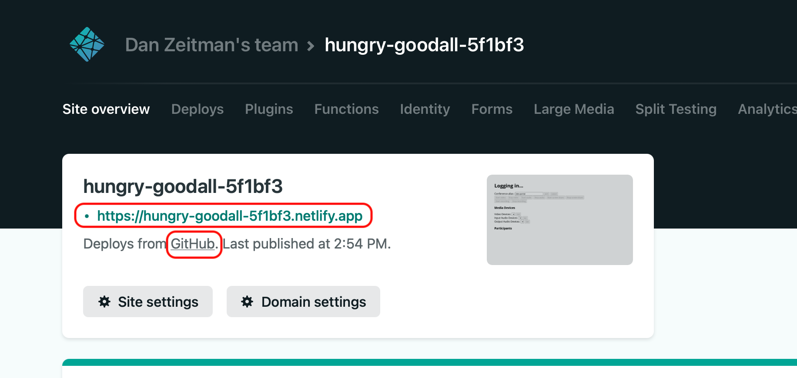

# :warning: This repository is no longer maintained :warning:

# Dolby.io Developer Days Communications APIs Getting Started Application

## About this Workshop and Application (v1.2)
 
This example is targeted for rapid deployment with Netlify. The example contains a front-end application and a serverless function to authenticate with the Dolby.io API.  

This example may also be adapted for hosting on other services. 

For the purposes of this workshop, you'll need to sign-up to following platforms:
- [Dolby.io](https://dolby.io)
- [GitHub](https://github.com)
- [Netlify](https://netlify.com)

The application works across all the majory browsers, however we recommend using Chrome to take advantage of additional features offered by the browser. 

To get started sign-in to each platform in a different tab and follow along with the instructions: 

##  How to Install and deploy this project on Netlify:

 - First you'll need an **Consumer API key** and **Consumer API secret** to comunicate with the Dolby.io APIs:
  
	- Select the  **SIGN IN**  link located in the upper right corner of the [Dolby.io](https://dolby.io) page. 
     - Log in using your email and password.
     - Sign-in will bring you to the applications summary page.
     - Create a new application and/or select an existing application.
     - When you select the application name, that will display your API keys. 
  
  In the next step we will deploy to Netlify. Clicking that button will automatically clone this repo to your personal or organization's GitHub account, then deploy this application directly to Netlify, creating a fully functioning website and serverless function endpoint.
  - Next click this button:
  
    

  - You'll see an auth dialog, click **Connect to GitHub** to link your account. 
  
  
   
  -  Next, you'll need to fill-in a few values before hiting **Save and Deploy**; this will save a clone of this project to your GitHub account and deploy to Netlify. 

  

- **Repository Name**  which will be set to the name of this repo; feel free to modify the name to something else if desired. This will be the name of the cloned version you'll see associated with your GitHub account or organization.
- Fill-in the other fields with your **CONSUMER_KEY** and **CONSUMER_SECRET** which you can find in the Dolby.io dashboard.
    These values will be stored in the site's deployment settings as pre-populated environment variables.
- Click **Save and Deploy** to continue; and in about 45 seconds, Netlify will automatically clone the repo and create a new site on Netlify.

-  Once it has deployed, you'll find both the link to the GitHub clone and your project's URL at the top of the site overview page in your Netlify admin console, from there and you'll be able to visit the new site you just created.
  

  

  Congrats! You've just deployed your first Dolby.io Communication API video conference app!
